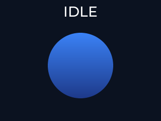
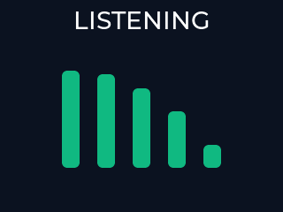
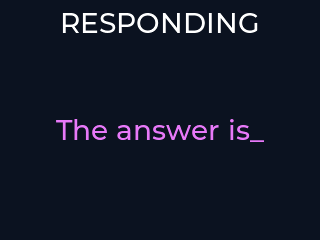

# pse84_assistant

PSE84 Voice Assistant PoC (Zephyr). See the master plan at
`.claude/plans/compiled-snuggling-nygaard.md` for the full roadmap.

Phase 1 (Track A) lands the four-state LVGL animation + state machine:
`sw0` (gpio_keys / INPUT_KEY_0, SDL SPACE under native_sim) cycles
`IDLE → LISTENING → THINKING → RESPONDING → IDLE`, each swapping a
procedural animation. See [`docs/ANIMATIONS.md`](docs/ANIMATIONS.md)
for the sprite-sheet-vs-procedural tradeoff.

## Hardware build (PSE84 kit)

```bash
cd zephyr_workspace/zephyrproject && source zephyr/zephyr-env.sh
cd -
west build -b kit_pse84_eval/pse846gps2dbzc4a/m55 \
    -s zephyr_workspace/pse84_assistant -p always --sysbuild
```

Flashing is covered elsewhere (`reference_pse84_flash_addresses.md` — M33
`--hex-addr 0x60100000`, not `0x22011000`).

## Off-hardware development (native_sim)

`native_sim` lets the LVGL + input path be verified visually on a Linux
host (or a Linux container from macOS) with no PSE84 hardware. The SDL
display driver provides a window, and `zephyr,gpio-emul-sdl` maps an SDL
keyboard scancode to the same `gpio_keys` / INPUT_KEY_0 path used on HW,
so `src/main.c` runs unmodified.

Files that drive this:
- `boards/native_sim.overlay` — SDL display chosen node, `sw0` → gpio0
  pin 1 → SDL SCANCODE_SPACE (44).
- `prj_native_sim.conf` — strips PSE84-specific peripherals (GFXSS, I2C,
  octal flash, shell) and turns on the SDL display + `CONFIG_LV_COLOR_DEPTH_32`
  (native_sim SDL runs RGBA8888).

### Build

Zephyr's POSIX arch (which backs `native_sim`) is Linux-only — macOS can
NOT build or run the binary directly. Two options:

**Option A — native Linux host**:
```bash
source zephyr_workspace/zephyrproject/zephyr/zephyr-env.sh
west build -b native_sim/native/64 \
    -d build_native \
    -s zephyr_workspace/pse84_assistant \
    -p always \
    -- -DCONF_FILE=prj_native_sim.conf

./build_native/zephyr/zephyr.exe
# Press SPACE in the SDL window to cycle states:
#   IDLE       -> gradient orb breathing (size + opacity over 2 s)
#   LISTENING  -> 5-bar VU meter, heights animated out of phase
#   THINKING   -> rotating lv_spinner (amber arc)
#   RESPONDING -> typing-effect label with blinking cursor
# The top-of-screen status label always shows the current state name.
```

**Option B — macOS via OrbStack / Docker (build only; SDL window needs
X forwarding or a Linux desktop to actually render)**:
```bash
docker run --rm -it \
    -v "$HOME/code/claude:$HOME/code/claude" \
    -v "$HOME/zephyr-sdk-1.0.0:/opt/toolchains/zephyr-sdk-1.0.0" \
    -w "$PWD" \
    -e ZEPHYR_SDK_INSTALL_DIR=/opt/toolchains/zephyr-sdk-1.0.0 \
    ghcr.io/zephyrproject-rtos/ci:v0.28.7 bash -c '
    source zephyr_workspace/zephyrproject/zephyr/zephyr-env.sh &&
    west build -b native_sim/native/64 -d build_native_docker \
        -s zephyr_workspace/pse84_assistant -p always \
        -- -DCONF_FILE=prj_native_sim.conf'
```

Running the binary from the container prints the `pse84_assistant`
banner via the emulated UART but SDL display init fails without a
display server. For visual verification use Option A or add X
forwarding (Linux VM / XQuartz + network X).

## Headless PNG snapshots (Track E, Part 1)

For code review or design critique where the person looking at the repo
doesn't need an interactive window — just a rendered still per state —
use the headless snapshot path. It runs entirely inside the Zephyr CI
container (no X forwarding / XQuartz needed), captures one PNG per
assist state, and commits the PNGs under `snapshots/`.

Committed output:






Regenerate locally:

```bash
./zephyr_workspace/pse84_assistant/tools/capture_snapshots.sh
```

How it works:

- `prj_native_sim_snapshot.conf` + `boards/native_sim_snapshot.overlay`
  swap the SDL display for Zephyr's in-tree `zephyr,dummy-dc` (the
  `dummy` SDL video driver refuses to allocate a renderer, so we avoid
  SDL entirely and render through LVGL's own software draw buffer).
- `CONFIG_APP_SNAPSHOT=y` routes `main()` into a timer-driven state
  sweep that forces each of the four assist states in turn, pumps
  `lv_timer_handler()` for 1.5 s so animations have moved off their
  frame-0 pose, then calls `lv_snapshot_take()` and streams the result
  as a P6 PPM via `nsi_host_{open,write}` trampolines. After the
  fourth state the app calls `nsi_exit(0)`.
- `tools/capture_snapshots.sh` builds inside
  `ghcr.io/zephyrproject-rtos/ci:v0.28.7` (SDK 1.0.0 from the host),
  runs the binary with `SDL_VIDEODRIVER=dummy` as belt-and-suspenders,
  bind-mounts `snapshots/` into the container as `/tmp/snapshots/`,
  and post-processes the PPMs to PNG with Pillow (falls back to
  `sips` on macOS). The PPM intermediates are removed after conversion.

Limitations:

- Resolution is 320×240 (native_sim's display size); HW is 800×480.
  For pixel-accurate UI review bump `dummy_dc` in
  `boards/native_sim_snapshot.overlay` and retune LVGL layout, but the
  current snapshot size is a good preview for composition and colour.
- Only a single still per state. The 1500 ms pump puts each animation
  somewhere distinctive but non-deterministic — the IDLE orb size and
  LISTENING bar heights will vary from run to run.

## Viewing live LVGL on macOS (Track E, Part 2)

`native_sim`'s SDL display can be forwarded from a Linux container to a
macOS desktop via XQuartz, so you can iterate on LVGL visuals live —
SPACE advances state, all four procedural animations run in real time.

### One-time host setup

1. `brew install --cask xquartz`
2. Log out + back in (XQuartz registers its X11 socket at login).
3. Launch XQuartz. Open *XQuartz → Settings → Security* (older builds
   call the menu *Preferences*), tick **Allow connections from network
   clients**, and restart XQuartz.
4. In a macOS terminal, authorise the local user:
   ```bash
   xhost +si:localuser:$USER
   ```
   (Or, less restrictively: `xhost +localhost`.)

### Run the app with X forwarding

```bash
docker run --rm -it \
    -v "$HOME/code/claude:$HOME/code/claude" \
    -v "$HOME/zephyr-sdk-1.0.0:/opt/toolchains/zephyr-sdk-1.0.0" \
    -w "$HOME/code/claude/embedded-assistant" \
    -e HOME=/tmp \
    -e ZEPHYR_SDK_INSTALL_DIR=/opt/toolchains/zephyr-sdk-1.0.0 \
    -e DISPLAY=host.docker.internal:0 \
    ghcr.io/zephyrproject-rtos/ci:v0.28.7 \
    bash -lc 'source zephyr_workspace/zephyrproject/zephyr/zephyr-env.sh && \
        west build -b native_sim/native/64 \
            -d zephyr_workspace/pse84_assistant/build_native_x11 \
            -s zephyr_workspace/pse84_assistant -p always \
            -- -DCONF_FILE=prj_native_sim.conf && \
        ./zephyr_workspace/pse84_assistant/build_native_x11/zephyr/zephyr.exe'
```

Expected: a 320×240 SDL window appears with the IDLE orb breathing.
SPACE cycles `IDLE → LISTENING → THINKING → RESPONDING → IDLE`; the
top-of-screen label mirrors the active state.

### Troubleshooting

- `Could not initialize SDL: No available video device` — X forwarding
  isn't reaching the container. Re-run `xhost +si:localuser:$USER` on
  the host, and check `echo $DISPLAY` **inside** the container prints
  `host.docker.internal:0`.
- `cannot open display: host.docker.internal:0` — "Allow connections
  from network clients" isn't checked in XQuartz settings, or XQuartz
  wasn't restarted after toggling it.
- `No XRandR extension` — happens on some XQuartz rebuilds. Reinstall
  XQuartz (`brew reinstall --cask xquartz`) and log out / back in.
- Window opens but stays black — the app aborted before LVGL flushed a
  frame; check the container stdout for the `pse84_assistant` banner
  and any LVGL errors.

## M55 QEMU smoke test (Track D)

A third build target runs the app on a real Cortex-M55 ISA inside QEMU
(Arm MPS3 Corstone-300 AN547 image — Armv8.1-M with MVE-I/MVE-F/FPU
enabled) so the state machine, framing, and Opus code paths can be
sanity-checked on an actual M55 without flashing hardware. Picked
`mps3/corstone300/an547` because it's the canonical Zephyr default for
this FPGA image; `mps3/corstone300/an552` is also Cortex-M55 and would
work equivalently.

Files that drive this:

- `boards/mps3_corstone300_an547.overlay` — intentionally empty; the
  upstream board DTS already provides uart0 (zephyr,console) + the MPS3
  memory map. No panel / gpio-keys are declared since QEMU models
  neither.
- `prj_qemu_m55.conf` — disables LVGL / display / input / GFXSS / I2C /
  octal flash (none of those exist on QEMU MPS3) and forces
  `CONFIG_OPUS=y` to compile libopus through the real M55 toolchain.
- `src/main.c` — `#ifdef CONFIG_LVGL` gates the LVGL + display + input
  path. When LVGL is disabled, a `k_timer` cycles `state_cycle()` every
  1 s and prints transitions to UART0, so the same state machine that
  runs on HW executes here.
- `src/CMakeLists.txt` — only compiles `src/ui.c` when `CONFIG_LVGL=y`.

### Build + run

```bash
docker run --rm \
    -v "$HOME/code/claude:$HOME/code/claude" \
    -w "$PWD" -e HOME=/tmp \
    -e ZEPHYR_SDK_INSTALL_DIR=/opt/toolchains/zephyr-sdk-1.0.1 \
    ghcr.io/zephyrproject-rtos/ci:v0.29.1 \
    bash -lc 'source zephyr_workspace/zephyrproject/zephyr/zephyr-env.sh && \
        west build -b mps3/corstone300/an547 -d build_qemu_m55 \
            -s zephyr_workspace/pse84_assistant -p always \
            -- -DCONF_FILE=prj_qemu_m55.conf && \
        west build -d build_qemu_m55 -t run'
```

Expected output (exit with `CTRL+a x`):

```text
*** Booting Zephyr OS build ...
[00:00:00.000,000] <inf> pse84_assistant: === PSE84 Assistant (Phase 1) ===
[00:00:00.000,000] <inf> pse84_assistant: headless mode: cycling state every 1000 ms
[00:00:01.000,000] <inf> assist_state: state: IDLE -> LISTENING
[00:00:01.000,000] <inf> pse84_assistant: headless tick -> LISTENING
[00:00:02.000,000] <inf> assist_state: state: LISTENING -> THINKING
... (cycles forever)
```

Memory usage: ~26 KB flash, ~154 KB RAM (libopus encode+decode contexts
are the dominant heap consumer).

### Ztest suites on M55

Both `tests/framing` and `tests/opus_roundtrip` are wired into twister
for `mps3/corstone300/an547` (see `platform_allow` +
`integration_platforms` in each `testcase.yaml`). Run:

```bash
docker run --rm \
    -v "$HOME/code/claude:$HOME/code/claude" \
    -w "$PWD" -e HOME=/tmp \
    -e ZEPHYR_SDK_INSTALL_DIR=/opt/toolchains/zephyr-sdk-1.0.1 \
    ghcr.io/zephyrproject-rtos/ci:v0.29.1 \
    bash -lc 'source zephyr_workspace/zephyrproject/zephyr/zephyr-env.sh && \
        west twister -p mps3/corstone300/an547 \
            -T zephyr_workspace/pse84_assistant/tests --inline-logs'
```

All 24 Ztest cases (16 framing + 8 opus_roundtrip) pass on the M55
target.

### M55-specific surprises

- **Opus PLC needs bigger Ztest stack.** `test_plc_accepts_zero_length_input`
  exercises the SILK decoder's PLC path, which allocates ~20+ KB of
  stack frames on Armv8.1-M (AAPCS prologues + MVE register-save
  areas are chunkier than native_sim's x86-64 compressed frames). The
  default `CONFIG_ZTEST_STACK_SIZE=16384` overflows with a USAGE
  FAULT. Bumped to 32 KB via
  `tests/opus_roundtrip/boards/mps3_corstone300_an547.conf` — this is
  per-board so native_sim keeps its compact sizing. Expect this to
  matter when the HW app starts running the decoder on its own thread
  (Phase 4): bump its thread stack to 32 KB up front.
- **Opus image cost on M55 is real.** libopus adds ~60 TUs and ~450 KB
  flash when linked in; the QEMU build shows just 26 KB because most
  of libopus's fixed-point silk/celt code gets dead-stripped with the
  app's minimal feature set. On HW with the full encoder+decoder path
  live, budget the advertised ~450 KB against the 2304 KB app slot
  (plenty of headroom).
- **QEMU MPS3 has no panel / no buttons.** The headless main-loop
  (`#ifdef CONFIG_LVGL`) branch is required — attempting to reuse the
  HW main loop would trip on `DEVICE_DT_GET(DT_CHOSEN(zephyr_display))`
  at compile time.

## Running tests (twister, native_sim)

The `tests/` tree carries Ztest suites exercised from the Docker-based CI
container so the host toolchain mismatch doesn't matter. Both suites run
on `native_sim/native/64`.

```bash
docker run --rm \
    -v "$HOME/code/claude:$HOME/code/claude" \
    -w "$PWD" -e HOME=/tmp \
    -e ZEPHYR_SDK_INSTALL_DIR=/opt/toolchains/zephyr-sdk-1.0.1 \
    ghcr.io/zephyrproject-rtos/ci:v0.29.1 \
    bash -lc 'source zephyr_workspace/zephyrproject/zephyr/zephyr-env.sh && \
        west twister -p native_sim/native/64 \
            -T zephyr_workspace/pse84_assistant/tests --inline-logs'
```

Suites:

- `tests/framing/` — pure-C `src/framing.c` coverage: encode/decode
  round-trip, streaming parser (partial SDUs, multiple frames per
  feed, mid-frame splits, unknown-type resync), bad-args handling.
  Mirrors `host/assistant_bridge/tests/test_framing.py` so the wire
  format is verified from both ends. **No libopus submodule required.**
- `tests/opus_roundtrip/` — instantiates `src/opus_wrapper.c` with
  CONFIG_OPUS=y, feeds a 1 kHz sine @ 16 kHz through encode → decode,
  asserts RMS energy is preserved (0.5x – 2x) after a 600 ms warm-up
  window. Requires the `zephyr_workspace/modules/libopus/opus`
  submodule to be initialised (`git submodule update --init --recursive`).

### Opus module (Track C)

libopus (xiph/opus, pinned to v1.5.2) is vendored under
`zephyr_workspace/modules/libopus/` as a Zephyr out-of-tree module. The
app `CMakeLists.txt` registers it via `ZEPHYR_EXTRA_MODULES` so no
patching of `zephyrproject/zephyr/west.yml` is required. Build options
force `FIXED_POINT=1` + `DISABLE_FLOAT_API` — no FPU dependency, and
both encoder and decoder are always present so the v3 TTS path can
reuse the same build.

- **CONFIG_OPUS=n (default)**: the `opus` INTERFACE target exists but
  contributes no sources; `opus_wrap_*` entry points return `-ENOTSUP`.
  The pse84_assistant HW + native_sim builds do not require the
  submodule to be checked out.
- **CONFIG_OPUS=y**: pulls the vendored sources and compiles in ~60
  Opus TUs. Roughly 450 KB flash on M55.

Initialise the submodule if you need the real codec:

```bash
git submodule update --init --recursive zephyr_workspace/modules/libopus/opus
```

### Behavior gaps vs. HW (for Tracks A and C)

- **Display resolution**: native_sim's SDL display defaults to 320×240
  (see `zephyr/drivers/display/display_sdl.c`); HW GFXSS is 800×480.
  UI layouts anchored with `LV_ALIGN_*` ports fine; fixed-coordinate
  placement (e.g. sprite sheets) will look offset.
- **Color depth**: native_sim is RGBA8888 (`LV_COLOR_DEPTH_32`); HW is
  RGB565 (`LV_COLOR_DEPTH_16`). If any sprite/asset bakes a depth, it
  will need both variants.
- **Input**: SDL keyboard (SPACE) maps to INPUT_KEY_0 — same input_cb in
  `src/main.c`. No scan-rate difference material for Track A animations.
- **No DSI panel bridge**: `display_blanking_off` is a no-op on the SDL
  display driver (returns `-ENOSYS`, which main.c already tolerates).
- **No octal flash / PSRAM / I2C**: any track that starts depending on
  XIP assets or the panel MCU (Track A sprite sheets from the 10 MB
  XIP region, Track C Opus from PSRAM if that lands) will need to
  either link assets into RAM for native_sim, or gate the dependency
  with `#ifdef CONFIG_BOARD_NATIVE_SIM`.
- **No M33 companion / IPC**: sysbuild is NOT used in the native_sim
  path. Any Phase 0b IPC work must provide a native_sim stub (e.g., a
  Zephyr-side mock endpoint) before it can be exercised here.

## Phase 2: PDM capture + UART hex dump

Press and hold `sw0` to capture up to 2 s of mono 16 kHz 16-bit PCM from
the PSE84's PDM microphone (controller 1 / channel 2, routed to the
pdm3 alt-io pin p8_6 per the in-tree `samples/drivers/audio/dmic`
reference overlay). Release to stop and stream the capture over the
console UART as hex, bracketed by `=== PCM_BEGIN … ===` / `=== PCM_END
===` markers. The companion host script
`host/audio_capture/receive_pcm.py` reassembles the dump into a WAV and
autoplays it — the entire loop verifies the PDM + DMA + UART path
end-to-end without a BLE link.

Firmware pieces:

- `boards/kit_pse84_eval_pse846gps2dbzc4a_m55.overlay` enables `dmic0`
  + `dmic0_ch2` (with `use-alt-io`), routes `clk_hf7` through
  `peri1_group1_16_5bit_2`, enables `dma0`, and bumps `uart2` to 921600
  baud. It also re-roots `gfxss` from under `dmic0` to `/soc` as a
  workaround for an upstream DMIC-driver / SoC-DTSI collision (the
  driver's `DT_FOREACH_CHILD_STATUS_OKAY` iterator treats every
  status=okay child of `pdm@44400000` as a PDM channel).
- `src/audio.c` owns a 2 s (64 KB) BSS ring buffer, a dedicated
  capture thread that drains 100 ms blocks from `dmic_read()`, and a
  `printk()`-based hex dumper (avoids the log subsystem's drop-under-
  burst failure mode).
- `src/main.c` wires the `gpio_keys` press/release edges to
  `audio_capture_start()` / `audio_capture_stop()`, deferring the stop
  + dump to the system workqueue to keep the input thread responsive.
  A `k_timer` enforces the 2 s cap if the user holds the button too
  long; press-shorter-than-100 ms captures are padded with trailing
  silence.

Run the host side (macOS):

```bash
# pyserial is in the project's zephyr-env pyenv venv.
~/.pyenv/versions/3.11.11/envs/zephyr-env/bin/python3 \
    host/audio_capture/receive_pcm.py
# -> "listening on /dev/cu.usbmodem1103 @ 921600 baud"
# hold sw0 on the kit, speak, release
# -> "captured N samples (M ms), peak=P, wav=…/captures/<ts>.wav"
# afplay auto-plays the WAV on macOS; aplay on Linux.
```

Unit tests for the hex-parse + WAV-write path live in
`host/audio_capture/tests/` and run with the system Python 3 (stdlib
only):

```bash
python3 -m unittest host.audio_capture.tests.test_receive_pcm -v
```

### Known issue: 921600 baud stability on KitProg3

The in-tree Infineon CAT1 UART driver's oversample search (see
`drivers/serial/uart_infineon_pdl.c`,
`IFX_UART_MAX_BAUD_PERCENT_DIFFERENCE = 10U`) accepts divider choices
up to 10 % off the requested baud. Empirically, the KitProg3 CDC
bridge on `kit_pse84_eval` ships UART traffic at 921600 with
intermittent single-byte corruption under sustained bursts, consistent
with a ~1 % baud drift. The framing is robust (`receive_pcm.py` drops
lines that don't parse as pure hex and retries on the next frame), but
for a large (~128 KB) hex payload one corrupted byte is sufficient to
fail a single capture. Follow-ups to evaluate:

- Override `&peri0_group1_16bit_0 { clock-div = … }` in the app
  overlay so the SCB UART's integer divider lands exactly on 921600.
- Fall back to 460800 baud (observed clean at 115200) if the clock
  tree can't be tuned — the hex dump still finishes in ~3 s.
- Switch to an RTT backend for the PCM payload (log over SWD instead
  of UART). `CONFIG_USE_SEGGER_RTT=y` is a one-line change and
  bypasses the CDC bridge entirely.
